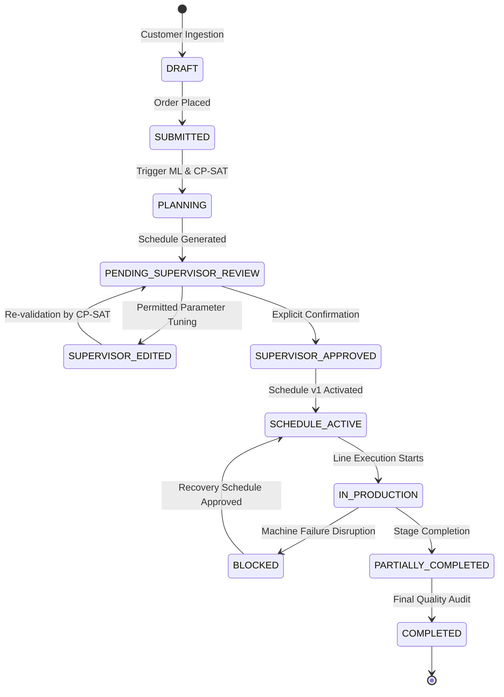
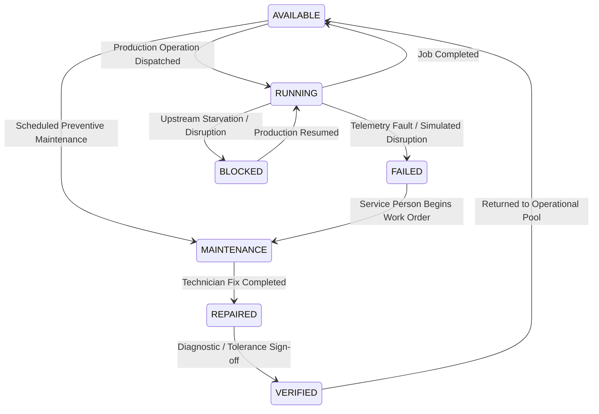

# ReFlow — Complete Data Lifecycle & State Transition Specification

**Platform:** ReFlow (Adaptive Production Intelligence)  
**Database:** MongoDB (Local / Atlas Enterprise)  
**Verification Date:** September 19, 2026  

---

## 1. Production Order Lifecycle

State transitions for production orders are strictly enforced at the database and service layers. No frontend client may bypass intermediate review gates.



### State Guard Rules:
- **`PENDING_SUPERVISOR_REVIEW` $\rightarrow$ `ACTIVE` Direct Bypass Blocked:** Direct activation from frontend state without calling `POST /api/v1/orders/plan/:id/approve` is rejected with `400 InvalidStateTransitionError`.
- **Approval Metadata Requirements:** Approval must store `approved_by`, `approved_at`, `approval_role`, `approval_notes`, and set `schedule_version: 1`.

---

## 2. Production Schedule Versioning

Production schedules are immutable and versioned to provide complete auditability.

| Schedule Version | State | Trigger / Event | Parent Schedule ID | Reason / Notes |
| :---: | :---: | :--- | :--- | :--- |
| **v1** | `ACTIVE` | Initial Supervisor Review & Approval | `None` (Root) | Initial Baseline Schedule generated by OR-Tools CP-SAT |
| **v1** | `SUPERSEDED` | Machine Disruption occurs on `CUT-02` | `None` | Shifted to historical baseline upon disruption |
| **v2** | `ACTIVE` | Manager approves Recovery Option A | `SCHED-ORD-1042-v1` | Dynamic re-routing of affected operations to `CUT-01` |

Every schedule record contains:
- `schedule_id`: Unique identifier (e.g., `SCHED-ORD-1042-v2`)
- `version`: Monotonically incrementing integer
- `parent_schedule_id`: Traceability link to predecessor schedule
- `created_by` & `created_at`: Actor attribution
- `status`: `ACTIVE`, `PENDING_APPROVAL`, `SUPERSEDED`, or `REJECTED`
- `operations`: Snapshot of scheduled operations with assigned workstations, workers, start, and end minutes.

---

## 3. Workstation / Machine State Lifecycle

Machine state transitions are strictly governed by `MachineWorkflow.validate_transition` in `backend/domain/machine_workflow.py`.



### Role-Based Transition Enforcement:
- **`FAILED` $\rightarrow$ `MAINTENANCE`**: Permitted by `SERVICE_PERSON`, `MANAGER`, or `ADMIN`.
- **`REPAIRED` $\rightarrow$ `VERIFIED`**: Requires `SERVICE_PERSON` sign-off or `MANAGER` verification.
- **`VERIFIED` $\rightarrow$ `AVAILABLE`**: Restricted to `MANAGER` or `ADMIN`.

---

## 4. Maintenance Work Order Lifecycle

Work order tickets manage mechanical repairs, technician assignments, and billing.

```text
[OPEN] (Work order created automatically on machine disruption)
   │
   ▼  Technician accepts ticket: POST /api/v1/maintenance/:id/accept
[ASSIGNED]
   │
   ▼  Technician arrives & starts repair: POST /api/v1/maintenance/:id/start
[IN_PROGRESS] (Machine status -> MAINTENANCE)
   │
   ▼  Parts replaced & calibrated: POST /api/v1/maintenance/:id/complete
[REPAIRED] (Machine status -> REPAIRED)
   │
   ▼  Vibration test & tolerance check: POST /api/v1/maintenance/:id/verify-and-restore
[VERIFIED] (Machine status -> VERIFIED -> AVAILABLE)
   │
   ▼  Manager or Admin archives record
[CLOSED]
```

---

## 5. Transaction Safety & Atomic Consistency

All high-impact state transitions follow an atomic pattern to prevent partial updates:
1. **Validation Phase:** Check precondition state, verify OR-Tools constraints, validate user JWT role.
2. **Persistence Phase:** Atomically update MongoDB documents using `$set` operations with condition filters.
3. **Audit Logging:** Record event in `audit_logs` collection with before/after state snapshots.
4. **WebSocket Broadcast:** Emit real-time events to all connected clients (`machine.status.updated`, `schedule.updated`, `notification.created`).
5. **Rollback Guarantee:** In the event of an unhandled exception, state mutations are aborted and clean domain error responses are returned.
